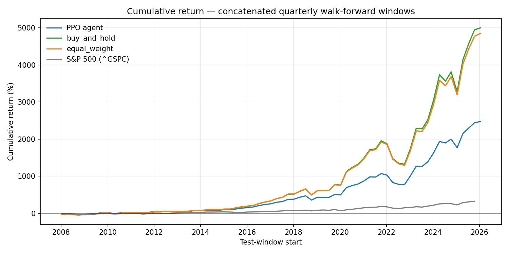
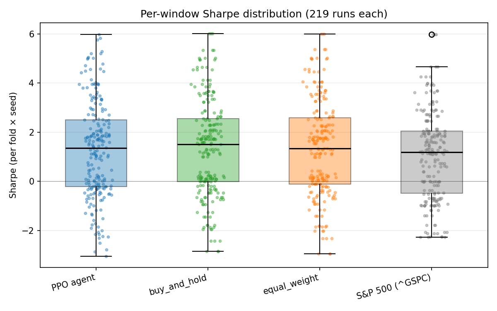
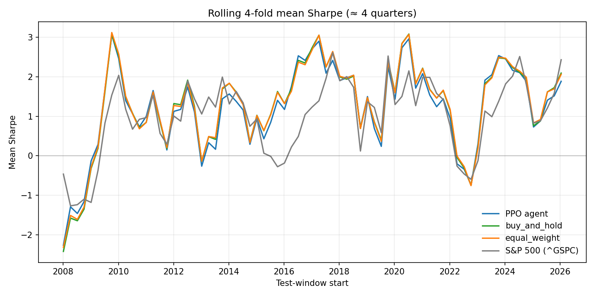
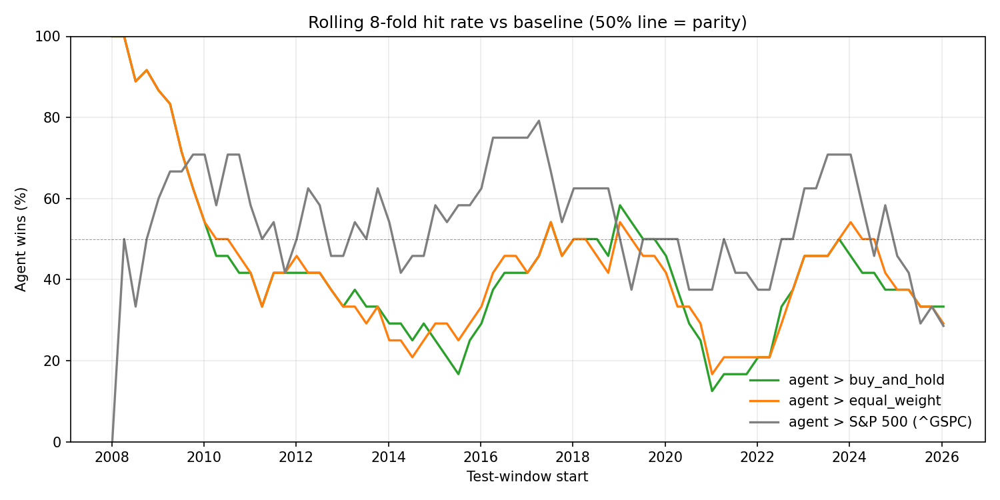

# RL Portfolio Optimization

A reinforcement learning-based portfolio optimization system using Stable-Baselines3, designed to showcase modern RL techniques applied to quantitative finance.

## Overview

This project implements a multi-asset portfolio allocation agent using deep reinforcement learning. The agent learns to dynamically rebalance a portfolio to maximize risk-adjusted returns while accounting for transaction costs and market dynamics.

### Key Features

- **Modular Architecture**: Extensible design with registry patterns for features, rewards, and baseline strategies
- **Multiple RL Algorithms**: Support for PPO, SAC, and A2C from Stable-Baselines3
- **Rich Feature Engineering**: Technical indicators (RSI, MACD, Bollinger Bands, etc.) using pandas-ta
- **Flexible Reward Functions**: Sharpe ratio, Sortino ratio, risk-adjusted returns, and more
- **Comprehensive Backtesting**: Compare RL agents against traditional baselines (equal weight, momentum, min variance, etc.)
- **Walk-Forward Evaluation**: Expanding-window walk-forward harness (library + CLI) for honest out-of-sample assessment across regimes
- **Professional Evaluation**: Complete metrics suite and visualization tools

## Installation

### Option 1: Using Conda (Recommended)

```bash
# Clone the repository
git clone <repository-url>
cd rlportfolio

# Create conda environment
conda env create -f environment.yml

# Activate environment
conda activate rlportfolio
```

### Option 2: Using pip + venv

```bash
# Clone the repository
git clone <repository-url>
cd rlportfolio

# Create virtual environment
python -m venv venv
source venv/bin/activate  # On Windows: venv\Scripts\activate

# Install dependencies
pip install -r requirements.txt
```

**Why conda?** Better dependency resolution for scientific computing packages (numpy, scipy, matplotlib) and easier management of platform-specific binaries.

### Development install

To work on the code and run the test suite, install the project in editable mode:

```bash
pip install -e .
```

This registers the `data`, `environment`, `evaluation`, `experiments`, and `training` packages on `sys.path` so imports resolve without needing a working directory hack. Run the tests with:

```bash
pytest tests/
```

## Quick Start

### 1. Train an Agent

```bash
# Train with default configuration (PPO on 5 tech stocks)
python training/train.py

# Train with custom configuration
python training/train.py --config configs/sac_config.yaml

# Resume from checkpoint
python training/train.py --resume training/models/portfolio_agent_50000_steps.zip
```

### 2. Evaluate a Trained Model

```bash
python training/train.py --eval training/models/best/best_model.zip
```

### 3. Run Backtests and Compare Strategies

```python
from data.fetcher import DataFetcher
from data.features import FeatureEngineer
from environment import PortfolioEnv
from evaluation import Backtester, plot_strategy_comparison
from stable_baselines3 import PPO

# Prepare data
fetcher = DataFetcher()
engineer = FeatureEngineer()
tickers = ['AAPL', 'MSFT', 'GOOGL', 'AMZN', 'NVDA']

data = fetcher.get_latest_data(tickers, days=500)
features = engineer.compute_features(data)
env_data = engineer.prepare_for_environment(features)

# Create environment
feature_cols = engineer.create_observation_columns()
env = PortfolioEnv(
    data=env_data,
    feature_columns=feature_cols,
    tickers=tickers
)

# Load trained agent
agent = PPO.load('training/models/best/best_model.zip')

# Run backtests
backtester = Backtester()
backtester.run_agent(agent, env, name='PPO')
backtester.run_baseline(env, 'equal_weight')
backtester.run_baseline(env, 'momentum_20')
backtester.run_baseline(env, 'min_variance_60')

# Compare results
backtester.print_comparison()

# Visualize
histories = backtester.get_histories()
plot_strategy_comparison(histories, save_path='results/comparison.png')
```

### 4. Walk-Forward Out-of-Sample Evaluation

For a rigorous OOS assessment across market regimes — trains a fresh agent on every fold's expanding window and backtests on the next disjoint slice:

```bash
# Quarterly walk-forward from 2005 to today, ~70 folds
conda run -n rlportfolio python -m evaluation.walk_forward \
    --config configs/opt_c_div19.yaml \
    --t-min-days 756 --stride-days 63 \
    --seeds 42 43 44 \
    --output results/walk_forward.csv
```

Produces a per-fold/per-seed CSV (agent + baselines on each disjoint test window), records failed runs for investigation, and prints aggregate run-level and fold-mean Sharpe / hit-rate summaries. The last 6 months of each fold's train window are reserved for model selection via `EvalCallback`, so the test window is never seen during training. Programmatic API in `evaluation.walk_forward.WalkForwardEvaluator`; see `examples/walk_forward.py` for a minimal driver.

## Project Structure

```
rlportfolio/
├── data/                     # Data fetching and feature engineering
│   ├── fetcher.py            # Thin adapter around finbase.DataClient
│   └── features.py           # Technical indicators with registry pattern
├── environment/              # Custom Gymnasium environment
│   ├── portfolio_env.py      # Multi-asset portfolio env (precomputed feature cube)
│   ├── rewards.py            # Reward function implementations
│   ├── transaction_costs.py  # Pluggable cost/slippage models
│   └── constants.py          # Shared numeric constants
├── training/                 # Training infrastructure
│   ├── train.py              # Training script + PortfolioTrainer
│   ├── config.py             # Typed TrainingConfig dataclasses
│   └── models/               # Saved models and checkpoints
├── evaluation/               # Backtesting and analysis
│   ├── metrics.py            # Performance metrics (Sharpe, Sortino, etc.)
│   ├── backtest.py           # Stateful Backtester facade
│   ├── backtest_strategies.py # Sequential / walk-forward / Monte Carlo execution
│   ├── baselines.py          # Baseline strategy implementations
│   ├── walk_forward.py       # Walk-forward training + OOS harness (library + CLI)
│   ├── visualization.py      # Plotting functions
│   └── visualize_network.py  # NN architecture visualization
├── experiments/              # Experiment tracking (W&B, MLflow, SQLite)
├── configs/                  # YAML configuration files (see directory for full list)
├── examples/                 # Thin demo scripts (walk_forward, seed_variance, ...)
└── tests/                    # Unit tests (320 passing)
```

## Architecture

### Data Pipeline

1. **DataFetcher**: Thin adapter over `finbase.DataClient`, which reads from a
   shared SQLite database at `~/.finbase/timeseries.db`. Data is populated and
   refreshed by the `finbase` project — this repo only reads it.
2. **FeatureEngineer**: Computes technical indicators using a registry pattern for extensibility
3. Features are normalized and prepared for the RL environment

### Environment

- **State Space**: Market features (prices, indicators) + current portfolio state (weights, cash)
- **Action Space**: Continuous portfolio weights (normalized via softmax)
- **Reward**: Configurable (Sharpe ratio, returns, risk-adjusted, etc.)
- **Transaction Costs**: Proportional costs are applied during rebalancing.
  Slippage defaults to zero for backward compatibility; custom cost models can
  use fixed, volume-based, or spread-based slippage, with `volume`,
  `bid_ask_spread`, or `spread` columns passed into trade records when present.

### Training

- Uses Stable-Baselines3 for RL algorithms
- Supports PPO (default), SAC, and A2C
- Configuration via YAML files
- Tensorboard logging and model checkpointing
- Evaluation callback for validation
- **Disjoint train/val**: `PortfolioTrainer.prepare_data` fetches a single combined window of `train_days + val_days` and slices on date, so val is strictly after train (no in-sample leakage into the eval callback).

### Evaluation

- **Metrics**: Total return, Sharpe ratio, Sortino ratio, max drawdown, volatility, win rate, etc.
- **Baselines**: Equal weight, buy-and-hold, momentum, minimum variance, inverse volatility
- **Walk-Forward**: Expanding-window protocol that retrains per fold; last 6 months of each fold's train reserved for model selection; disjoint quarterly test windows. Library (`evaluation.walk_forward.WalkForwardEvaluator`) and CLI (`python -m evaluation.walk_forward`).
- **Visualization**: Performance comparison, drawdown, weights evolution, risk-return scatter

## Configuration

Configurations are stored in `configs/` as YAML files. Key parameters:

```yaml
data:
  tickers: [AAPL, MSFT, GOOGL, AMZN, NVDA]
  universe:
    mode: static_current
    survivorship_bias: known
  train_days: 730

environment:
  initial_balance: 10000.0
  transaction_cost: 0.001
  reward_function: sharpe

agent:
  algorithm: PPO
  learning_rate: 0.0003
  policy_kwargs:
    net_arch: [256, 256, 128]

training:
  total_timesteps: 100000
```

`data.universe.mode: static_current` is the only supported universe policy
today. It reuses the configured ticker list across every period and marks
outputs with `survivorship_bias: known`; it does not reconstruct historical
index membership. `point_in_time_index` is reserved for future support and
fails validation instead of silently behaving like a static universe.

## Extending the Framework

### Add Custom Features

```python
from data.features import Feature

class MyCustomFeature(Feature):
    def __init__(self):
        super().__init__('my_feature')

    def compute(self, df):
        df['my_indicator'] = df['Close'].rolling(10).mean()
        return df

    def get_column_names(self):
        return ['my_indicator']

# Use it
engineer = FeatureEngineer(custom_features=[MyCustomFeature()])
```

### Add Custom Reward Functions

```python
from environment.rewards import RewardFunction

class MyReward(RewardFunction):
    def compute(self, portfolio_return, portfolio_value, previous_value, **kwargs):
        # Your custom logic
        return portfolio_return * 2  # Example
```

### Add Custom Baseline Strategies

```python
import numpy as np

from environment.constants import CASH_SOFTMAX_BIAS
from evaluation.backtest import Backtester
from evaluation.baselines import BaselineStrategy

class MyStrategy(BaselineStrategy):
    def __init__(self):
        super().__init__('my_strategy')

    def get_action(self, env, step, **kwargs):
        action = np.ones(env.n_assets + 1)
        action[-1] = CASH_SOFTMAX_BIAS
        return action

# Register it
backtester = Backtester()
backtester.baseline_registry.register(MyStrategy())
```

## Data Sources

Market data is sourced through **`finbase.DataClient`**, a shared SQLite-backed
client used across the FinAI projects. The local database lives at
`~/.finbase/timeseries.db`. Populating and refreshing that database is the
responsibility of the `finbase` package; this repo is a read-only consumer.

See `data/fetcher.py` for the thin adapter layer.

## Results

The numbers below come from a single command, with seeds and configs fixed
in this repo. They are **honest, not flattering** — the point of the table
is reproducibility, not marketing. See "Limitations & Honest Caveats" below
for what these numbers do and do not mean.

### Walk-forward, tech5 universe (AAPL, MSFT, GOOGL, AMZN, NVDA)

<!-- WF_TECH5_TABLE_START -->
_Walk-forward, expanding-window protocol. 73 folds × 3 seeds = 219/219 successful runs (0 failed). Quarterly stride, 3-year minimum train, 6-month in-sample selection slice. Test windows 2008-01-04 → 2026-04-16._

| Strategy | Mean Sharpe | Median Sharpe | Sharpe σ | Mean total return | Mean max DD | Hit rate vs agent |
| --- | ---: | ---: | ---: | ---: | ---: | ---: |
| **RL agent (PPO)** | +1.273 | +1.360 | 1.963 | +5.09% | -9.26% | — |
| buy_and_hold | +1.344 | +1.509 | 1.976 | +6.32% | — | 40% |
| equal_weight | +1.346 | +1.346 | 1.969 | +6.27% | — | 40% |
| S&P 500 (^GSPC, buy & hold) | +1.039 | +1.185 | 1.788 | +2.32% | — | 54% |

Hit rate = fraction of (fold, seed) runs where the agent's Sharpe strictly beat the baseline's on the same disjoint test window.
<!-- WF_TECH5_TABLE_END -->

### Visual analysis

Generated by `scripts/plot_walk_forward.py` from the same CSV.

**Concatenated quarterly returns** — what each strategy compounds to if you
chain the per-fold quarterly returns end-to-end. The PPO agent (blue)
visibly underperforms the in-universe baselines (green/orange) from
~2017 onwards, while clearly beating the S&P 500 (grey). The agent is
losing to a rebalanced basket of the *same* tickers, not to the market.



**Per-window Sharpe distribution** — boxplot + jittered points across all
219 (fold, seed) runs. The four distributions overlap heavily; the
agent's median Sharpe is about 0.15 below the in-universe baselines and
~0.15 above the S&P 500. No strategy meaningfully escapes the others
when the per-window noise is shown directly.



**Rolling 4-fold mean Sharpe** — the agent (blue) and in-universe
baselines (green/orange) move almost identically through every regime,
which is consistent with the agent learning a near-equal-weight policy.
The S&P 500 (grey) tracks differently and is generally lower over this
sample.



**Rolling 8-fold hit rate** — the most diagnostic plot. Vs the S&P 500
the agent stays mostly above the 50% parity line (agent picked a better
universe). Vs the in-universe baselines the agent spends 2014-2022
*below* parity — losing more often than winning — and only catches up
in 2018-2019 and 2024. The 50% line is what matters; persistent
deviations either way require a statistical test before being called
"edge".



**Reading the table.** Two comparisons matter and they tell different
stories:

- **Agent vs in-universe baselines (`buy_and_hold`, `equal_weight`).**
  The agent does **not** beat them. Mean Sharpe trails by ~0.07, mean
  total return trails by ~120 bps per quarter, and the agent's Sharpe
  exceeds each baseline's in only 40% of (fold, seed) runs (baselines
  win 60% of the time). After ten basis points of round-trip cost the
  PPO policy looks like a slightly noisier version of equal-weight.
  The agent is not adding stock-selection or timing alpha within this
  universe.
- **Agent vs broad market (`^GSPC` buy-and-hold, net of one initial
  transaction cost).** The agent edges the S&P 500 by ~+0.23 mean
  Sharpe and the agent wins 54% of the time. **But** the in-universe
  baselines also clear the S&P 500 by ~+0.30 Sharpe — so essentially
  the entire "edge vs market" comes from the universe selection
  (megacap tech 2008-2026), not from the RL policy. Universe
  cherry-picking explains it; the model does not.

This is not a flattering result and it is not meant to be — it is what
the protocol returned. See "Limitations & Honest Caveats" below for
what would have to change to credibly claim an edge.

**Reproduce:**

```bash
conda run -n rlportfolio python -m evaluation.walk_forward \
    --config configs/opt_c_tech5.yaml \
    --t-min-days 756 --stride-days 63 \
    --seeds 42 43 44 \
    --output results/walk_forward_tech5.csv

conda run -n rlportfolio python scripts/results_table.py \
    results/walk_forward_tech5.csv \
    --update-readme README.md --marker WF_TECH5_TABLE
```

Each (fold, seed) trains a fresh PPO agent on the expanding window of all
data prior to the test slice, with the last 6 months of that train window
held out for in-sample model selection (`EvalCallback` picks the best
checkpoint). The selected model is then backtested on the disjoint
quarterly test window. The default `WalkForwardConfig.baselines` runs
`buy_and_hold` and `equal_weight` on the same test window for direct
comparison; richer baselines (`momentum`, `min_variance`,
`inverse_vol`) are available via `--baselines`. Per-fold metrics land
in `results/walk_forward_tech5.csv`; the table above is generated by
`scripts/results_table.py`.

### Methodology notes

Quarterly protocol with 3-year minimum train, 1-quarter stride and disjoint
test windows, 6-month in-sample selection slice. See
`evaluation/walk_forward.py` for all knobs. Each CSV row records
`universe_mode`, `survivorship_bias`, `n_assets`, and `tickers_hash` so
downstream analysis keeps the universe assumption attached to the result.

## Limitations & Honest Caveats

RL on financial data is famously hard. The harness here addresses some of the
classical pitfalls, but not all — and the framework cannot rescue you from the
ones it does not. Read this section before drawing conclusions from any
specific run.

**What this code does NOT solve:**

- **Survivorship bias.** `data.universe.mode: static_current` reuses today's
  ticker list across every historical fold. Any "AAPL was already in the
  universe in 2015" backtest implicitly excludes the names that were in the
  index in 2015 but later got delisted, acquired, or removed (Lehman, Sears,
  GE-pre-spinoffs, …). Index-style claims should be treated as survivorship-
  biased unless you pipe in a real point-in-time membership source.
  `point_in_time_index` mode is reserved but not implemented.
- **Non-stationarity.** Equity dynamics are regime-dependent. An agent trained
  on 2015-2021 (low-rate, post-GFC bull) is not the same problem as 2022-2024
  (rate hikes, war, AI mania). Walk-forward exposes this by re-training each
  fold, but if your tickers, features, or hyperparameters were chosen by
  staring at the full sample first, you have already leaked future information
  into your model selection.
- **Hyperparameter overfitting.** Reported numbers come from the configs
  checked into `configs/`. They have not been searched against the
  walk-forward test set — but if you tune anything against walk-forward
  output and re-report, that is also leakage.
- **Backtest ≠ live trading.** Order fills assume your trade gets the
  closing price with proportional slippage. There is no execution latency,
  no liquidity constraint, no borrow cost on shorts (and the env is
  long-only anyway), no minimum-tick rounding, and no overnight gap risk
  modeled separately from intraday. `transaction_costs.py` provides
  pluggable cost / slippage models; using anything richer than the default
  proportional cost is on the user.
- **Normalization is point-in-time, not "fit on the sample".** The
  current `prepare_for_environment` only applies causal transforms:
  `pct_change(lookback_window)` (purely backward-looking),
  `rsi / 100.0` (constant), `atr / close` (point-in-time). There is no
  global mean/std fit — so changing to a per-fold scaler would be a
  no-op on the current feature set. If you add z-score / min-max
  features later, the harness would need a per-fold `.fit()` then.
- **Action-space inductive bias.** Continuous weights via softmax with an
  explicit cash dimension means the agent can never short, never lever
  beyond 1.0×, and always maintains a valid simplex. That is a strong
  prior — useful for learning stability, but it rules out long/short and
  market-neutral strategies a priori.
- **Reward-function dependence.** Sharpe / Sortino / drawdown-penalised
  rewards each shape behaviour differently and the right choice is not
  obvious. None of them solve the deeper problem that *test-set Sharpe*
  is what you actually care about and you cannot use it as a training
  signal.
- **Data source.** Market data flows through `finbase.DataClient`, which
  reads adjusted close from a shared SQLite store. Adjustments (splits,
  dividends) are applied historically; if `finbase` corrects an old bar
  retroactively, your saved walk-forward CSVs will not match a fresh
  re-run. There is no guarantee of point-in-time-as-of integrity.

**What this code does aim to address:**

- **Look-ahead in indicators.** All rolling features are left-aligned;
  `prepare_for_environment` applies per-ticker `ffill` (no cross-ticker
  pollution); the env zero-fills any remaining warm-up NaN.
- **Train/val leakage.** `PortfolioTrainer.prepare_data` fetches one
  combined window and slices by date so val is strictly after train.
- **Single-window cherry-picking.** The `walk_forward.py` harness retrains
  per fold on disjoint test windows. The README results table reports
  fold-mean Sharpe, hit rate vs baselines, and Sharpe σ — not a single
  number from a single run.
- **Reproducibility.** Every CSV row records `universe_mode`,
  `survivorship_bias`, `n_assets`, `tickers_hash`, seed, and fold
  geometry. The exact command that produced README numbers is in the
  Results section above.

**What "the agent beats the baselines" actually means here.** Hit rate is the
fraction of (fold, seed) runs where the agent's Sharpe strictly exceeds the
baseline's on the same disjoint test window. A hit rate near 50% on a noisy
metric like Sharpe is consistent with no real edge — the agent could be a
coin flip vs equal-weight. Treat hit rates above ~60% with cautious interest
and below ~55% as not statistically distinguishable from chance without
formal testing (bootstrap CI / paired tests, not implemented here).

## Requirements

- Python 3.8 - 3.12 (recommended: 3.11 or 3.12)
- stable-baselines3 >= 2.7.0
- gymnasium >= 1.0.0
- See `requirements.txt` or `environment.yml` for full dependencies

## License

MIT License

## Acknowledgments

- Built with [Stable-Baselines3](https://github.com/DLR-RM/stable-baselines3)
- Technical indicators from [pandas-ta](https://github.com/twopirllc/pandas-ta)
- Market data via the internal `finbase` SQLite client
